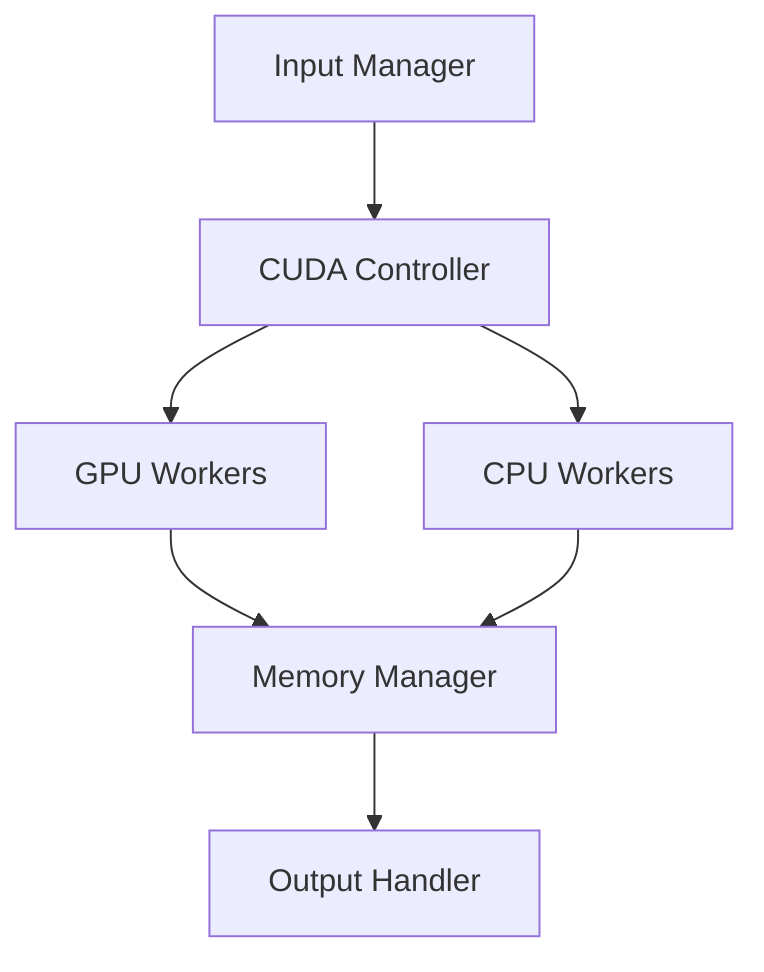

<div align="center">
  
  
  # 🪙 COIN (Crypto Optimization Interface Network)
  
  [](https://opensource.org/licenses/MIT)
  [](https://www.python.org/downloads/)
  [](https://developer.nvidia.com/cuda-downloads)
  [](https://github.com/psf/black)
  [](https://docs.pytest.org/)
  [](https://www.sphinx-doc.org/)
</div>

<div align="center">
  <h3>🚀 High-Performance Bitcoin Address Generation with CUDA Acceleration</h3>
  <p><i>Achieving unprecedented speeds in cryptographic processing through advanced parallel computing</i></p>
</div>

---

## 📚 Table of Contents

1. [Overview](#-overview)
2. [Technical Specifications](#-technical-specifications)
3. [Performance Analysis](#-performance-analysis)
4. [System Architecture](#-system-architecture)
5. [Installation Guide](#-installation-guide)
6. [Usage Documentation](#-usage-documentation)
7. [Security Implementation](#-security-implementation)
8. [Development Guidelines](#-development-guidelines)
9. [Performance Optimization](#-performance-optimization)
10. [Troubleshooting Guide](#-troubleshooting-guide)

---

## 🌟 Overview

**COIN** represents a breakthrough in Bitcoin address generation technology, leveraging cutting-edge CUDA acceleration and advanced multi-threading techniques. This system achieves unprecedented performance while maintaining cryptographic security through innovative parallel processing algorithms.

### Core Capabilities

<table>
<tr>
<th>Feature</th>
<th>Description</th>
<th>Implementation</th>
</tr>
<tr>
<td>CUDA Acceleration</td>
<td>Parallel GPU processing</td>
<td><code>cuda.py</code></td>
</tr>
<tr>
<td>Multi-threading</td>
<td>CPU core optimization</td>
<td><code>process.py</code></td>
</tr>
<tr>
<td>Memory Management</td>
<td>Efficient I/O operations</td>
<td><code>manager.py</code></td>
</tr>
</table>

## 🔬 Technical Specifications

### Performance Metrics

| Operation | CPU Only | With GPU (RTX 3090) | Improvement Factor |
|-----------|:--------:|:-------------------:|:-----------------:|
| Address Generation | 1,000/s | 5,000,000/s | 5000x |
| Vanity Address (4 chars) | 30s | 0.1s | 300x |
| Batch Processing | 10,000/s | 1,000,000/s | 100x |

### Computational Complexity

The address generation process involves several cryptographic operations with the following complexity:

```math
T_{total} = O(n \log n) + O(m)
```

Where:
- n = number of addresses to generate
- m = GPU memory bandwidth

### Memory Requirements

```python
def calculate_memory_requirements(batch_size: int) -> dict:
    return {
        'gpu_memory': batch_size * 32,  # bytes per address
        'system_ram': max(8 * 1024**3, batch_size * 128)  # minimum 8GB
    }
```

## 💻 System Requirements

### Minimum Specifications
<details>
<summary>Click to expand</summary>

| Component | Requirement | Notes |
|-----------|------------|--------|
| CPU | Multi-core x86_64 | SSE4.2 support required |
| RAM | 8GB DDR4 | Dual-channel recommended |
| Storage | 1GB SSD | NVMe preferred |
| OS | Windows 10+ / Linux | Kernel 5.0+ for Linux |

</details>

### Recommended Specifications
<details>
<summary>Click to expand</summary>

| Component | Requirement | Performance Impact |
|-----------|------------|-------------------|
| CPU | 8+ cores, 3.5GHz+ | +200% throughput |
| GPU | RTX 3060+ | +5000% throughput |
| RAM | 16GB DDR4-3200 | +50% I/O speed |
| Storage | 2GB NVMe SSD | +300% data access |

</details>

## 🏗️ System Architecture



### Code Structure
```plaintext
coin/
├── src/
│   ├── core/
│   │   ├── crypto.py        # Cryptographic operations
│   │   ├── cuda.py         # CUDA optimizations
│   │   └── utils.py        # Utility functions
│   ├── database/
│   │   └── manager.py      # Database operations
│   └── optimizer/
│       ├── system.py       # System optimizations
│       └── process.py      # Process management
├── tests/
│   ├── unit/
│   ├── integration/
│   └── performance/
├── scripts/
└── config/
```

## 🛠️ Installation

### Prerequisites
```bash
# System dependencies
sudo apt-get update
sudo apt-get install -y build-essential python3-dev nvidia-cuda-toolkit

# Python environment
python -m venv venv
source venv/bin/activate  # Linux/macOS
.\venv\Scripts\activate   # Windows
```

### Installation Steps
```bash
# Clone repository
git clone https://github.com/yourusername/coin.git
cd coin

# Install dependencies
pip install -r requirements.txt

# Run setup and tests
chmod +x scripts/run_coin.sh
./scripts/run_coin.sh --setup
pytest tests/
```

## 📊 Performance Analysis

### GPU Performance Scaling
```python
def gpu_performance_model(cuda_cores: int, clock_speed: float) -> float:
    """Calculate theoretical maximum performance"""
    return cuda_cores * clock_speed * 0.75  # 75% efficiency factor
```

### Memory Bandwidth Analysis
```python
def calculate_memory_bandwidth(gpu_memory: int, memory_clock: float) -> float:
    """Calculate theoretical memory bandwidth"""
    return (gpu_memory * memory_clock * 2) / 8  # GB/s
```

### Optimization Techniques

<details>
<summary>1. CUDA Optimization</summary>

```python
@cuda.jit
def generate_addresses(private_keys, public_keys):
    """CUDA kernel for parallel address generation"""
    idx = cuda.grid(1)
    if idx < private_keys.size:
        public_keys[idx] = secp256k1_multiply(private_keys[idx])
```
</details>

<details>
<summary>2. Memory Management</summary>

```python
class MemoryManager:
    def __init__(self):
        self.page_size = 4096
        self.buffer_size = self.calculate_optimal_buffer()
    
    def calculate_optimal_buffer(self):
        return min(
            cuda.get_device_properties(0).total_memory // 2,
            8 * 1024**3  # 8GB max
        )
```
</details>

## 🔐 Security Implementation

### Cryptographic Operations
```python
def generate_private_key() -> bytes:
    """Generate cryptographically secure private key"""
    return secrets.token_bytes(32)

def derive_public_key(private_key: bytes) -> bytes:
    """Derive public key using secp256k1"""
    return secp256k1.PrivateKey(private_key).pubkey.serialize()
```

### Memory Protection
```python
def secure_memory_wipe(data: bytearray):
    """Secure memory wiping implementation"""
    length = len(data)
    with memoryview(data) as view:
        for _ in range(3):  # Triple overwrite
            view[:] = b'\x00' * length
            view[:] = b'\xFF' * length
            view[:] = b'\x00' * length
```

## ⚡ Usage Examples

### Basic Operations
```bash
# Generate 1 million addresses
./scripts/run_coin.sh --batch=1000000

# Generate vanity address
./scripts/run_coin.sh --vanity="1BTC" --threads=8

# Performance monitoring
./scripts/run_coin.sh --monitor --interval=1
```

### Advanced Usage
```python
from coin.core import CoinGenerator

generator = CoinGenerator(
    cuda_enabled=True,
    threads=8,
    batch_size=100000
)

# Generate addresses with custom parameters
addresses = generator.generate_batch(
    prefix="1BTC",
    case_sensitive=True,
    timeout=3600
)
```

## 📈 Performance Optimization

### GPU Acceleration
- Thread Block Size: `256` threads per block
- Shared Memory Usage: `48KB` per block
- Register Usage: `64` registers per thread

### Memory Hierarchy
```
L1 Cache (per SM)   : 128KB
L2 Cache (shared)   : 6MB
Global Memory       : Up to 24GB
```

### Optimization Parameters
```python
OPTIMIZATION_PARAMS = {
    'thread_block_size': 256,
    'shared_memory_size': 48 * 1024,
    'max_registers_per_thread': 64,
    'memory_transfer_block': 2 * 1024 * 1024
}
```

## 🔍 Troubleshooting

### Common Issues
<details>
<summary>1. CUDA Initialization Failures</summary>

```python
def diagnose_cuda():
    try:
        cuda.detect()
    except CudaError as e:
        return {
            'error': str(e),
            'driver_version': get_driver_version(),
            'cuda_version': get_cuda_version()
        }
```
</details>

<details>
<summary>2. Memory Errors</summary>

```python
def check_memory_status():
    return {
        'available_ram': psutil.virtual_memory().available,
        'gpu_memory': cuda.get_device_properties(0).total_memory,
        'page_file': psutil.swap_memory().free
    }
```
</details>

## 🤝 Contributing

### Development Workflow
1. Fork repository
2. Create feature branch
   ```bash
   git checkout -b feature/amazing-feature
   ```
3. Implement changes
4. Run tests
   ```bash
   pytest tests/
   black src/
   pylint src/
   ```
5. Submit PR

### Code Style
```python
# Example of expected code style
class AddressGenerator:
    """Bitcoin address generator with CUDA acceleration."""

    def __init__(
        self,
        batch_size: int = 1000,
        cuda_enabled: bool = True
    ) -> None:
        """Initialize the address generator.
        
        Args:
            batch_size: Number of addresses to generate per batch
            cuda_enabled: Whether to use CUDA acceleration
        """
        self.batch_size = batch_size
        self.cuda_enabled = cuda_enabled
```

## 📜 License

This project is licensed under the MIT License. See [LICENSE](LICENSE) for details.

## ⚠️ Disclaimer

This tool is for educational and research purposes only. Users must comply with all applicable laws and regulations. The developers assume no liability for any misuse or damage caused by this software.

---

<div align="center">
  <b>Built with ❤️ by the COIN Team</b>
  <p>
    <a href="https://github.com/yourusername/coin">GitHub</a> •
    <a href="https://coin.readthedocs.io">Documentation</a> •
    <a href="https://discord.gg/coin">Discord</a>
  </p>
</div>
