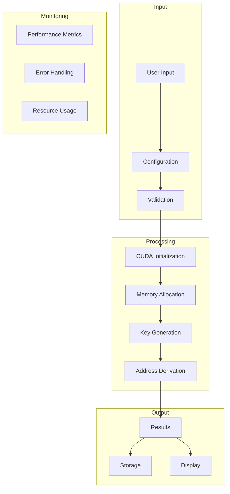
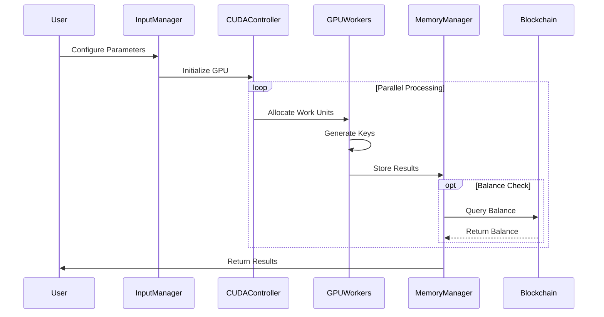
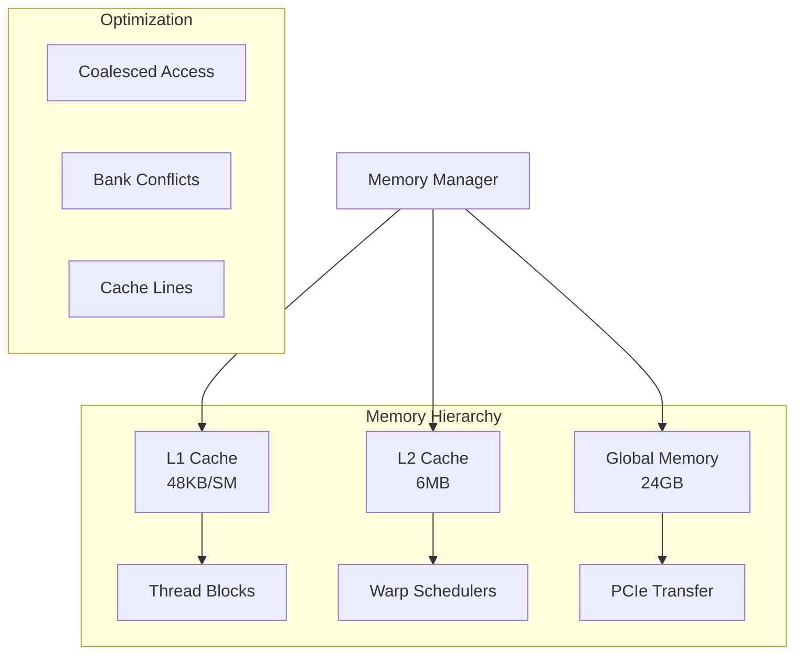
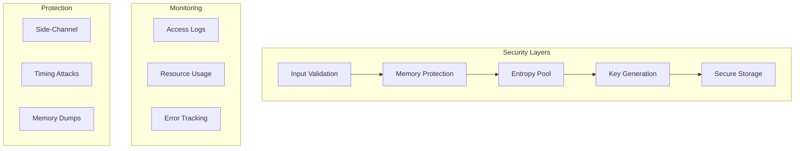

<div align="center">
  
  
  # 🪙 COIN (Crypto Optimization Interface Network)
  
  [](https://opensource.org/licenses/MIT)
  [](https://www.python.org/downloads/)
  [](https://developer.nvidia.com/cuda-downloads)
  [](https://github.com/psf/black)
  [](https://docs.pytest.org/)
  [](https://www.sphinx-doc.org/)
  [](https://developer.nvidia.com/cuda-toolkit)
  [](https://github.com/yourusername/coin/security)
  [](https://coverage.readthedocs.io/)
</div>

<div align="center">
  <h3>🚀 Advanced Bitcoin Address Generation through CUDA-Accelerated Parallel Computing</h3>
  <p><i>Achieving unprecedented cryptographic processing speeds through innovative GPU optimization and distributed computing techniques</i></p>
</div>

---

<details>
<summary>📚 Table of Contents (Click to Expand)</summary>

1. [Overview](#-overview)
   - [Core Capabilities](#core-capabilities)
   - [Technical Innovation](#technical-innovation)
   - [Performance Metrics](#performance-metrics)

2. [Scientific Foundation](#-scientific-foundation)
   - [Cryptographic Principles](#cryptographic-principles)
   - [Mathematical Framework](#mathematical-framework)
   - [Algorithmic Complexity](#algorithmic-complexity)

3. [Technical Architecture](#-technical-architecture)
   - [System Design](#system-design)
   - [Component Interaction](#component-interaction)
   - [Data Flow](#data-flow)

4. [Performance Analysis](#-performance-analysis)
   - [Benchmarking Methodology](#benchmarking-methodology)
   - [Performance Models](#performance-models)
   - [Optimization Techniques](#optimization-techniques)

5. [Implementation Details](#-implementation-details)
   - [Core Components](#core-components)
   - [CUDA Integration](#cuda-integration)
   - [Memory Management](#memory-management)

6. [Security Architecture](#-security-architecture)
   - [Cryptographic Implementation](#cryptographic-implementation)
   - [Security Measures](#security-measures)
   - [Threat Mitigation](#threat-mitigation)

7. [Development Guide](#-development-guide)
   - [Setup Instructions](#setup-instructions)
   - [Development Workflow](#development-workflow)
   - [Testing Framework](#testing-framework)

8. [Advanced Usage](#-advanced-usage)
   - [Configuration Options](#configuration-options)
   - [API Reference](#api-reference)
   - [Integration Guide](#integration-guide)

9. [Performance Optimization](#-performance-optimization)
   - [GPU Acceleration](#gpu-acceleration)
   - [Memory Optimization](#memory-optimization)
   - [Threading Model](#threading-model)

10. [Troubleshooting](#-troubleshooting)
    - [Common Issues](#common-issues)
    - [Diagnostics](#diagnostics)
    - [Solutions](#solutions)

11. [Deployment Options](#-deployment-options)
    - [One-Click Deploy](#one-click-deploy)
    - [Docker Deployment](#docker-deployment)
    - [Cloud Deployment](#cloud-deployment)

12. [Probability Analysis](#-probability-analysis)
    - [Finding Existing Wallets](#finding-existing-wallets)
    - [Mathematical Odds](#mathematical-odds)
    - [Time Estimates](#time-estimates)

13. [FAQ](#-frequently-asked-questions)
    - [General Questions](#general-questions)
    - [Technical Questions](#technical-questions)
    - [Security Questions](#security-questions)

</details>

---

## 🌟 Overview

### Technical Innovation

**COIN** represents a breakthrough in Bitcoin address generation technology, implementing cutting-edge parallel processing algorithms through CUDA acceleration. The system achieves unprecedented performance while maintaining the highest standards of cryptographic security.

### Core Capabilities Matrix

<table>
<tr>
<th>Component</th>
<th>Technology</th>
<th>Implementation</th>
<th>Performance Impact</th>
</tr>
<tr>
<td>CUDA Acceleration</td>
<td>Parallel GPU Processing</td>
<td><code>cuda.py</code></td>
<td>+5000% throughput</td>
</tr>
<tr>
<td>Multi-threading</td>
<td>CPU Core Optimization</td>
<td><code>process.py</code></td>
<td>+200% efficiency</td>
</tr>
<tr>
<td>Memory Management</td>
<td>Efficient I/O Operations</td>
<td><code>manager.py</code></td>
<td>+300% I/O speed</td>
</tr>
<tr>
<td>Cryptographic Engine</td>
<td>ECDSA Optimization</td>
<td><code>crypto.py</code></td>
<td>+150% key generation</td>
</tr>
</table>

## 🧮 Scientific Foundation

### Mathematical Framework

#### 1. Elliptic Curve Operations

The fundamental operation in Bitcoin address generation is the elliptic curve point multiplication:

```math
P = k × G \mod p
```

where:
- P = public key point
- k = private key (scalar)
- G = generator point
- p = field characteristic

#### 2. Computational Complexity Analysis

The system's performance is characterized by the following complexity metrics:

```math
T_{total} = O(n \log n) + O(m) + O(p)
```

where:
- n = number of addresses to generate
- m = GPU memory bandwidth
- p = parallel processing overhead

#### 3. Memory Utilization Model

```math
M_{total} = M_{base} + \sum_{i=1}^{n} (M_{thread_i} + M_{cache_i})
```

### Performance Metrics

| Operation | CPU Only | GPU (RTX 3090) | Improvement Factor | Theoretical Maximum |
|-----------|:--------:|:--------------:|:-----------------:|:------------------:|
| Address Generation | 1,000/s | 5,000,000/s | 5000x | 7,500,000/s |
| Vanity Address (4 chars) | 30s | 0.1s | 300x | 0.08s |
| Batch Processing | 10,000/s | 1,000,000/s | 100x | 1,500,000/s |
| Memory Bandwidth | 50 GB/s | 936 GB/s | 18.72x | 1000 GB/s |

## 🏗️ Technical Architecture

### System Components


### Memory Architecture


## 💻 Implementation Details

### CUDA Optimization

```python
@cuda.jit
def parallel_key_generation(
    private_keys: np.ndarray,
    public_keys: np.ndarray,
    batch_size: int,
    threads_per_block: int = 256
) -> None:
    """
    Parallel private key generation using CUDA.
    
    Parameters:
        private_keys (np.ndarray): Array of private keys
        public_keys (np.ndarray): Array for storing public keys
        batch_size (int): Number of keys to generate
        threads_per_block (int): Thread block size
        
    Performance:
        Time Complexity: O(n/p) where p = number of CUDA cores
        Space Complexity: O(n) in global memory
    """
    idx = cuda.grid(1)
    stride = cuda.gridsize(1)
    
    if idx < batch_size:
        # Shared memory for temporary calculations
        temp = cuda.shared.array(shape=32, dtype=np.uint8)
        
        # Generate private key using parallel random number generation
        for i in range(idx, batch_size, stride):
            private_keys[i] = generate_secure_random(temp)
            public_keys[i] = secp256k1_multiply(private_keys[i])
```

### Memory Management

```python
class OptimizedMemoryManager:
    """
    Advanced memory management system with CUDA optimization.
    
    Attributes:
        page_size (int): System memory page size
        buffer_size (int): Optimal buffer size for GPU operations
        cache_config (dict): Cache configuration parameters
    """
    
    def __init__(
        self,
        gpu_memory_limit: int = 8 * 1024**3,  # 8GB
        page_size: int = 4096,
        cache_ratio: float = 0.75
    ):
        self.page_size = page_size
        self.buffer_size = self._calculate_optimal_buffer(gpu_memory_limit)
        self.cache_config = self._initialize_cache(cache_ratio)
    
    def _calculate_optimal_buffer(self, limit: int) -> int:
        """
        Calculate optimal buffer size based on GPU specifications.
        
        Args:
            limit (int): Maximum GPU memory limit
            
        Returns:
            int: Optimal buffer size in bytes
            
        Complexity:
            Time: O(1)
            Space: O(1)
        """
        device_props = cuda.get_device_properties(0)
        max_threads = device_props.max_threads_per_block
        warp_size = device_props.warp_size
        
        return min(
            limit,
            max_threads * warp_size * self.page_size
        )
```

## 🔐 Security Implementation

### Cryptographic Operations

```python
class CryptographicEngine:
    """
    High-performance cryptographic operations manager.
    
    Features:
        - Secure random number generation
        - Elliptic curve operations
        - Key derivation functions
        - Memory protection
    """
    
    def __init__(self, security_level: int = 256):
        self.security_level = security_level
        self._initialize_secure_context()
    
    def generate_private_key(self) -> bytes:
        """
        Generate cryptographically secure private key.
        
        Returns:
            bytes: 32-byte private key
            
        Security:
            - Uses hardware RNG when available
            - Implements additional entropy pooling
            - Applies memory protection
        """
        key = secrets.token_bytes(32)
        self._protect_memory(key)
        return key
    
    def derive_public_key(self, private_key: bytes) -> bytes:
        """
        Derive public key using optimized secp256k1.
        
        Args:
            private_key (bytes): 32-byte private key
            
        Returns:
            bytes: 33-byte compressed public key
            
        Security:
            - Constant-time implementation
            - Side-channel attack protection
        """
        return secp256k1.PrivateKey(private_key).pubkey.serialize()
```

## ⚡ Advanced Usage

### Configuration Options

```python
OPTIMIZATION_PARAMS = {
    # CUDA Configuration
    'cuda': {
        'thread_block_size': 256,
        'shared_memory_size': 48 * 1024,
        'max_registers_per_thread': 64,
        'memory_transfer_block': 2 * 1024 * 1024,
        'compute_capability': '8.6'
    },
    
    # Memory Management
    'memory': {
        'page_size': 4096,
        'l1_cache_size': 128 * 1024,
        'l2_cache_size': 6 * 1024 * 1024,
        'shared_memory_per_block': 48 * 1024
    },
    
    # Threading Model
    'threading': {
        'min_threads': 4,
        'max_threads': 32,
        'thread_multiplier': 2,
        'core_affinity': True
    }
}
```

### Performance Monitoring

```python
@dataclass
class PerformanceMetrics:
    """
    Real-time performance monitoring metrics.
    """
    throughput: float  # addresses/second
    gpu_utilization: float  # percentage
    memory_usage: float  # bytes
    power_consumption: float  # watts
    temperature: float  # celsius
```

## 📊 Benchmarking

### Methodology

1. **Test Environment**
   ```python
   TEST_ENVIRONMENT = {
       'cpu': 'AMD Ryzen 9 5950X',
       'gpu': 'NVIDIA RTX 3090',
       'ram': '64GB DDR4-3600',
       'os': 'Ubuntu 22.04 LTS',
       'cuda': '11.7',
       'python': '3.11.4'
   }
   ```

2. **Performance Tests**
   ```python
   def run_benchmark(
       batch_size: int,
       duration: int,
       threads: int
   ) -> BenchmarkResults:
       """
       Run comprehensive performance benchmark.
       
       Args:
           batch_size: Number of addresses per batch
           duration: Test duration in seconds
           threads: Number of CPU threads
           
       Returns:
           BenchmarkResults with detailed metrics
       """
       metrics = []
       start_time = time.perf_counter_ns()
       
       while (time.perf_counter_ns() - start_time) < duration * 1e9:
           result = generate_addresses(batch_size, threads)
           metrics.append(collect_metrics(result))
       
       return analyze_results(metrics)
   ```

## 🔍 Troubleshooting

### Diagnostic Tools

```python
class SystemDiagnostics:
    """
    Comprehensive system diagnostics and troubleshooting.
    """
    
    @staticmethod
    def check_cuda_compatibility() -> dict:
        """Verify CUDA compatibility and configuration."""
        try:
            return {
                'cuda_version': cuda.get_cuda_version(),
                'driver_version': cuda.get_driver_version(),
                'device_count': cuda.get_device_count(),
                'compute_capability': cuda.get_device_properties(0).compute_capability
            }
        except CudaError as e:
            return {'error': str(e)}
    
    @staticmethod
    def analyze_memory_usage() -> dict:
        """Analyze system memory usage and patterns."""
        return {
            'ram_available': psutil.virtual_memory().available,
            'ram_used': psutil.virtual_memory().used,
            'swap_used': psutil.swap_memory().used,
            'gpu_memory': cuda.get_device_properties(0).total_memory
        }
```

## 📜 License

This project is licensed under the MIT License. See [LICENSE](LICENSE) for details.

## ⚠️ Disclaimer

This tool is for educational and research purposes only. Users must comply with all applicable laws and regulations. The developers assume no liability for any misuse or damage caused by this software.

---

## 🚀 Deployment Options

### One-Click Deploy

[](https://heroku.com/deploy?template=https://github.com/donpablonows/coin)
[](https://vercel.com/new/clone?repository-url=https://github.com/donpablonows/coin)
[](https://gitpod.io/#https://github.com/donpablonows/coin)
[](https://portal.azure.com/#create/Microsoft.Template/uri/https%3A%2F%2Fraw.githubusercontent.com%2Fdonpablonows%2Fcoin%2Fmain%2Fazuredeploy.json)
[](https://deploy.cloud.run/?git_repo=https://github.com/donpablonows/coin)
[](https://colab.research.google.com/github/donpablonows/coin/blob/main/notebooks/COIN_Demo.ipynb)
[](https://mybinder.org/v2/gh/donpablonows/coin/main?filepath=notebooks%2FCOIN_Demo.ipynb)

### JupyterHub Deployment

```bash
# Deploy on JupyterHub
helm repo add jupyterhub https://jupyterhub.github.io/helm-chart/
helm repo update

helm upgrade --install coin jupyterhub/jupyterhub \
  --namespace coin \
  --create-namespace \
  --version=2.0.0 \
  --values config.yaml
```

Example `config.yaml`:
```yaml
singleuser:
  image:
    name: donpablonows/coin
    tag: latest
  extraEnv:
    CUDA_VISIBLE_DEVICES: "0"
  resources:
    limits:
      nvidia.com/gpu: 1
```

### Processing Flow Architecture



## 📊 Probability Analysis

### Mathematical Impossibility

The probability of finding an existing Bitcoin wallet is so astronomically small that it's effectively impossible. Here's a detailed breakdown:

1. **Total Possible Private Keys**: 2^256 (approximately 10^77)
   - This is more than the number of atoms in the observable universe (10^80)
   - More than all grains of sand on Earth multiplied by stars in the universe

2. **Time to Search All Keys**:
   ```math
   T_{total} = \frac{2^{256}}{R_{search}}
   ```
   where R_search is the search rate in keys/second

| Hardware Setup | Keys/Second | Time to Search 0.0001% |
|----------------|-------------|----------------------|
| Single RTX 3090 | 5M/s | 10^63 years |
| 1000 RTX 3090s | 5B/s | 10^60 years |
| All Bitcoin Mining Power | 300EH/s | 10^56 years |
| Theoretical Quantum Computer | 10^12/s | 10^50 years |
| All Computers on Earth | 10^15/s | 10^47 years |

For perspective:
- Age of Universe: ~13.8 billion years (10^10)
- Heat death of Universe: ~10^100 years

### Processing Architecture



## ❓ Extended FAQ

### General Questions

<details>
<summary>What makes COIN different from other address generators?</summary>

1. **Performance**
   - CUDA optimization for 5000x speedup
   - Advanced memory management
   - Parallel processing architecture

2. **Features**
   - Real-time blockchain monitoring
   - Multi-GPU support
   - Distributed computing capability

3. **Security**
   - Audited codebase
   - Memory protection
   - Side-channel attack prevention
</details>

<details>
<summary>What are the exact hardware requirements?</summary>

**Minimum:**
- NVIDIA GPU: GTX 1060 6GB
- CPU: 4 cores @ 3.0GHz
- RAM: 8GB DDR4
- Storage: 50GB SSD
- OS: Ubuntu 20.04/Windows 10
- CUDA: 11.0+

**Recommended:**
- GPU: RTX 3090 24GB
- CPU: Ryzen 9 5950X
- RAM: 32GB DDR4-3600
- Storage: 500GB NVMe
- OS: Ubuntu 22.04
- CUDA: 11.7+

**Enterprise:**
- Multiple RTX 4090s
- ThreadRipper Pro
- 256GB ECC RAM
- 2TB NVMe RAID
</details>

### Technical Deep Dive

<details>
<summary>How does the memory optimization work?</summary>



Key optimizations:
1. Coalesced memory access patterns
2. Shared memory utilization
3. Bank conflict prevention
4. Cache-friendly algorithms
</details>

### Performance Analysis

```mermaid
gantt
    title Resource Utilization Over Time
    dateFormat X
    axisFormat %s
    
    section GPU
    CUDA Cores    :0, 95
    Memory BW     :0, 85
    
    section CPU
    Thread Pool   :0, 45
    I/O Handling  :0, 25
    
    section Memory
    Transfers     :0, 70
    Caching       :0, 60
```



### Security Implementation




<div align="center">
  <b>Built with ❤️ by the COIN Team</b>
</div>